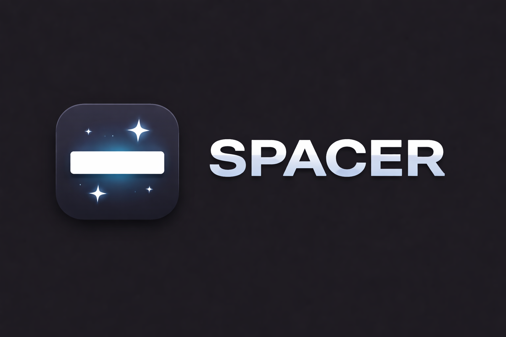

  

  <strong>Customize the spacing between macOS menu bar icons</strong> 
  Adjust icon gaps and selection padding. Choose from presets or dial in exact pixel values. Works on any Mac running macOS 14+.

  
  
  

  
  
  
  
  

  
  
  

  Built with Swift and SwiftUI. No Electron, no web views, no bloat.

---

## Download

Download the latest version from [**Releases**](https://github.com/beyondthecode-bc/MenuBarSpacing/releases/latest). Unzip, move `Menu Bar Spacing.app` to Applications, and launch.

The app includes a built-in update checker — open **About** (click the `?` icon) and click **Check Now** to see if a newer version is available.

### Verification

Every release is scanned on [VirusTotal](https://www.virustotal.com) before publishing. You can verify the download yourself:

| | |
|---|---|
| **SHA-256** | `70af1b5a33530c46c689a50e6e9c3c4a6c7a60f23ae7869972b7a73e4e534dc6` |
| **VirusTotal Report** | [View full scan results](https://www.virustotal.com/gui/file/70af1b5a33530c46c689a50e6e9c3c4a6c7a60f23ae7869972b7a73e4e534dc6) |

To verify the hash locally: `shasum -a 256 MenuBarSpacing.zip`

## Features

**Spacing Control**
- Adjust the gap between menu bar icons (0 – 30 px)
- Adjust the clickable selection padding around each icon (0 – 20 px)
- Link padding to spacing for proportional adjustments

**Presets**
- **Compact** — Maximum density (6 px spacing)
- **Tight** — Reduced gaps (12 px)
- **Default** — macOS default (17 px)
- **Comfortable** — Extra room (22 px)
- **Spacious** — Wide gaps (28 px)

**Live Preview**
- Approximate real-time visualization of how icons will look at the current spacing

**Apply Options**
- Apply & Reboot — saves settings and reboots immediately
- Apply & Log Out — saves settings and logs out
- Save Only — writes the preference without restarting
- Reset to Default — restores macOS default values

**About & Updates**
- Built-in update checker downloads new versions directly from GitHub releases
- GitHub repository link and support options (Buy Me a Coffee, GitHub Sponsors)
- Per-app language override with 8 supported languages

**Localization**
- 8 languages: English, French, German, Spanish, Japanese, Korean, Portuguese (Brazilian), Chinese (Simplified)
- Community translations welcome via pull requests

## How It Works

Menu Bar Spacing writes to the macOS `NSStatusItemSpacing` and `NSStatusItemSelectionPadding` preferences via `CFPreferences`. These are system-level settings that control how much space macOS puts between menu bar icons.

Changes require a **reboot or logout** to take effect — this is a macOS limitation, not an app limitation. The app provides convenient buttons to apply and restart in one step.

## Requirements

| | Requirement |
|---|---|
| **OS** | macOS 14.0 (Sonoma) or later |
| **Chip** | Any Mac (Apple Silicon or Intel) |

## Getting Started

### 1. Download and install

Download the latest `.zip` from [Releases](https://github.com/beyondthecode-bc/MenuBarSpacing/releases/latest), extract it, and move `Menu Bar Spacing.app` to your Applications folder.

### 2. Choose your spacing

Launch the app, pick a preset or use the sliders to set exact values.

### 3. Apply and restart

Click **Apply & Reboot** or **Apply & Log Out** to apply the changes. Your menu bar will reflect the new spacing after the restart.

## Translations

This repository hosts the translation files for Menu Bar Spacing. You can help translate the app into your language or improve existing translations.

### How to contribute

1. Fork this repository
2. Edit an existing file in the [`languages/`](languages/) folder, or create a new one by copying `English.xml`
3. Translate the string values (the text between `<string>` tags) — **do not** change the `key` attributes
4. Keep any `%1`, `%2`, `%@`, `%d` placeholders in place — the app needs them
5. Submit a pull request

### Current languages

| Language | File | Status |
|---|---|---|
| English | [`English.xml`](languages/English.xml) | Complete |
| French | [`French.xml`](languages/French.xml) | Complete |
| German | [`German.xml`](languages/German.xml) | Complete |
| Spanish | [`Spanish.xml`](languages/Spanish.xml) | Complete |
| Japanese | [`Japanese.xml`](languages/Japanese.xml) | Complete |
| Korean | [`Korean.xml`](languages/Korean.xml) | Complete |
| Portuguese (BR) | [`Portuguese.xml`](languages/Portuguese.xml) | Complete |
| Chinese (Simplified) | [`Chinese.xml`](languages/Chinese.xml) | Complete |

Want to add a new language? Copy `English.xml`, rename it to your language name, translate the values, and submit a PR.

## Bug Reports & Feature Requests

Please use [Issues](../../issues) to report bugs or request features.

## Support the Project

If Menu Bar Spacing helps you tame your menu bar, consider supporting development:

  
  &nbsp;&nbsp;&nbsp;
  

---

## Troubleshooting

### "Menu Bar Spacing" Not Opened — Gatekeeper warning

Menu Bar Spacing is not yet notarized with Apple. On first launch you may see a Gatekeeper warning.

**To fix this:**

1. Click **Done** to dismiss the dialog
2. Open **System Settings > Privacy & Security**
3. Scroll down — you'll see a message that Menu Bar Spacing was blocked
4. Click **Open Anyway**

This only needs to be done once. After that, the app will open normally.

### Nothing changed after applying

Menu bar spacing changes require a **reboot or logout** to take effect. This is a macOS limitation — the system reads these preferences at login time. Use the **Apply & Reboot** button for the quickest result.

### Administrator password required when installing an update

When you click **Install Now** in the About window, macOS will show a password prompt before replacing the app in `/Applications`. This is expected — the app needs elevated permissions to overwrite itself.
